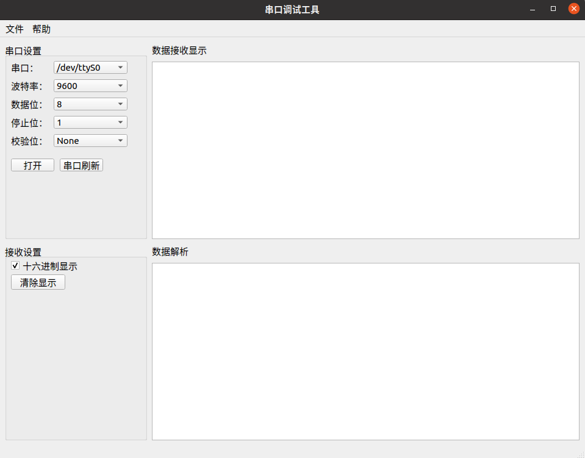

# 一款用于特定场景的串口调试工具
## A Serial Tool on Specific Environment

本项目已经发布。你可以在[**Releases**](https://github.com/Sweaterz/serialTest/releases)中下载对应版本。

The project has already been released. You can download it from [**Releases**](https://github.com/Sweaterz/serialTest/releases) right now!

### 已发布版本
### Released Version
v1.0.1

  

### Todo List:
- [x] UI布局  UI layout
- [x] 接收显示  display received data
- [ ] 解析协议数据  parse protocol data

### Support Operating system:

- [x] Ubuntu 20.04
- [X] Windows 10

If you have any question, you can put it on the Issues. 
First edit on 09:28, 16th April, 2024. Wednesday.

### Open Source Library
The serial library
- [wjwwood/serial](https://github.com/wjwwood/serial)  

Specifically see [LICENSE](https://github.com/sweaterz/serialTest/LICENSE) here.
